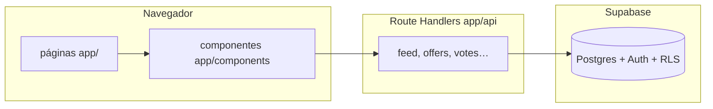

# AVENTA — Contexto del sistema (para equipo e IA)

Documento vivo: describe **qué hace cada parte**, **cómo se conecta** y **dónde tocar** el código. Stack: **Next.js (App Router)**, **Supabase**, **Vercel**.

---

## 1. Vista de una página



- **UI** vive en `app/` (páginas) y `app/components/`.
- **Lógica servidor** en `app/api/*/route.ts` y en `lib/` (importada desde esas rutas).
- **Persistencia** en Supabase; el servidor usa `SUPABASE_SERVICE_ROLE_KEY` donde aplica (`lib/supabase/server.ts`).

---

## 2. Carpetas importantes en la raíz

| Carpeta / archivo | Rol |
|-------------------|-----|
| `app/` | Rutas, layouts, UI y **todas** las APIs (`app/api`). |
| `lib/` | Lógica compartida: feed, afiliados, bot, votos, reputación, límites, etc. |
| `docs/supabase-migrations/` | SQL de referencia / migraciones (no sustituyen el panel de Supabase). |
| `tests/` | Pruebas (p. ej. contratos, bot ingest). |
| `middleware.ts` | Proxy Next (auth, reglas globales). |
| `vercel.json` | Crons que llaman a rutas `/api/cron/...`. |
| `.env.example` | Lista de variables; **secretos solo en `.env.local` / Vercel**. |

---

## 3. Páginas de producto (App Router)

| Ruta (ejemplo) | Qué es | Con qué habla |
|----------------|--------|----------------|
| `/` | Home / feed principal | `GET /api/feed/home` (y a veces Supabase directo según modo), `useOffersRealtime`, votos por batch |
| `/oferta/[id]` | Detalle de oferta | Datos de oferta, modal similar, comentarios |
| `/subir` | Flujo subir oferta | `POST /api/offers`, `POST /api/parse-offer-url`, imágenes |
| `/u/[username]` | Perfil público | `GET /api/profile/[username]` |
| `/admin/*` | Panel administración | Rutas `app/api/admin/*` con `requireAdmin` / roles |
| `/operaciones`, `/operaciones/trabajo` | Operaciones (no solo admin UI) | Estado del bot, `app-config`, etc. Mantenimiento: **`/admin/mantenimiento`** y **`docs/AGENDA_MANTENIMIENTO_OPERACIONES.md`**. |

**Componentes clave:** `OfferCard`, `OfferModal`, `ActionBar`, `Navbar` — manejan clic en oferta, compartir, votos y en muchos casos **tracking** (`/api/track-view`, `/api/track-outbound`, `/api/events`). La página canónica **`/oferta/[id]`** (`OfferPageContent`) en el CTA **“Ver oferta en tienda”** también llama a **`/api/track-outbound`** (mismo cuerpo que el modal: `offerId` + `Authorization` opcional).

---

## 4. APIs agrupadas por dominio

### 4.1 Feed y descubrimiento

| Endpoint | Función | Conexiones |
|----------|---------|------------|
| `GET /api/feed/home` | Lista ofertas para home (trending, filtros) | `lib/offers/feedService`, tablas `offers`, perfiles |
| `GET /api/feed/for-you` | Feed personalizado (requiere sesión) | Preferencias / votos del usuario |
| `GET /api/offers/similar` | Ofertas parecidas | Ofertas + embeddings o heurísticas según implementación |

### 4.2 Ofertas, votos, comentarios

| Endpoint | Función | Conexiones |
|----------|---------|------------|
| `POST /api/offers` | Crear oferta (usuario) | Afiliado: `resolveAndNormalizeAffiliateOfferUrl`, insert `offers` |
| `GET/POST /api/votes` | Votar | Tabla votos, pesos, posible realtime |
| `.../comments`, like, report` | Comentarios | Tablas comentarios, moderación |

### 4.3 Parsing y enlaces

| Endpoint | Función | Conexiones |
|----------|---------|------------|
| `POST /api/parse-offer-url` | Extrae título/precio/tienda desde URL (UI subir oferta) | Lógica similar pero **duplicada** respecto al bot: ver `lib/bots/ingest/fetchParsedOfferMetadata.ts` (comentario en código) |
| `POST /api/track-view` | Evento “vista” de oferta | `recordOfferEvent` → cola / DB |
| `POST /api/track-outbound` | Clic saliente hacia tienda | Mismo patrón que track-view, `event_type: outbound` |
| `POST /api/events` | Otros eventos cliente (p. ej. share) | Analytics / logs |

### 4.4 Afiliados y monetización (lado app)

| Pieza | Función | Conexiones |
|-------|---------|------------|
| `lib/affiliate/resolveAffiliateOfferUrl.ts` | Resuelve acortadores ML + aplica tags | `lib/offerUrl`, `applyPlatformAffiliateTags` |
| `lib/affiliate/applyPlatformAffiliateTags.ts` | Añade query params de programas (Amazon, ML, etc.) | Variables `NEXT_PUBLIC_*` / env por tienda |
| Uso en APIs | Al guardar o aprobar oferta se normaliza `offer_url` | `moderate-offer`, `offers`, `update-offer`, bot `insertIngestedOffer` |

**Ingresos reales:** los generan las **redes de afiliados**; la app **solo** asegura URLs etiquetadas y puede llevar **ledger interno** de comisiones (admin).

### 4.5 Admin

| Área | Rutas típicas | Rol |
|------|----------------|-----|
| Moderación | `moderate-offer`, `moderation-logs`, `update-offer`, `moderation-normalize-links` | Aprobar/rechazar, `link_mod_ok`, emails |
| Usuarios / equipo | `users`, `team`, `bans` | Roles en `lib/server/requireAdmin`, `lib/admin/roles` |
| Comisiones | `commissions/*`, `affiliate-ledger`, `affiliate-programs` | Pools, asignaciones, ledger |
| Operaciones | `operations-pulse`, `go-no-go`, `product-metrics` | Salud del producto |
| Bot | `bot-ingest-status`, `bot-ingest-run-now`, `app-config` | Pausa en DB, estado env, run manual |

### 4.6 Crons (Vercel)

Protegidos con **`CRON_SECRET`** (`lib/server/cronAuth.ts`).

| Ruta | Propósito |
|------|-----------|
| `/api/cron/bot-ingest` | Ciclo del bot (ML + Amazon + score + insert) |
| `/api/cron/daily-digest`, `weekly-digest` | Emails / resúmenes |
| `/api/cron/system-integrity` | Chequeos |
| `/api/cron/process-write-queue` | Drena cola de escrituras (eventos, etc.) |

Frecuencias en `vercel.json`.

### 4.7 Otros

| Endpoint | Notas |
|----------|--------|
| `GET /api/app-config` | Flags públicos (p. ej. tester offers) |
| `GET /api/health` | Salud |
| `POST /api/log-client-event` | Telemetría cliente |

---

## 5. Módulo `lib/` (mapa rápido)

| Carpeta | Responsabilidad |
|---------|-------------------|
| `lib/bots/ingest/*` | **Bot v3:** config env, ML API + multiget, Amazon ASIN, scoring, título, insert `offers`, tope diario, boost AM |
| `lib/affiliate/*` | Normalización y tags de afiliado |
| `lib/offers/*` | Feed, transform a tarjeta, filtros home, scoring de ofertas en feed si aplica |
| `lib/supabase/*` | Cliente browser, servidor (service role) |
| `lib/server/*` | Admin/cron auth, rate limit, write queue, integridad, reputación servidor |
| `lib/commissions/*` | Lógica de comisiones / payouts |
| `lib/monitoring/*` | Errores de feed, health, eventos |
| `lib/email/*` | Plantillas y envío (moderación, etc.) |
| `lib/contracts/*` | Tipos/contratos compartidos con tests |

---

## 6. Bot de ingesta — flujo interno

```
vercel.json (cron cada 15 min)
    → GET /api/cron/bot-ingest + CRON_SECRET
        → runIngestCycle (lib/bots/ingest/runIngestCycle.ts)
            → ¿app_config bot_ingest_paused?
            → ¿BOT_INGEST_ENABLED? ¿tope diario?
            → ¿ventana boost ~7h local? (marca en app_config)
            → collectIngestItems (rotación ML / Amazon / URLs)
            → por candidato: meta (API ML precomputada o fetch HTML)
            → filtros duros + scoreIngestCandidate
            → insertIngestedOffer (approved o pending) + URL afiliada
```

**Documentación de variables:** `.env.example` (sección Bot v3).

---

## 7. Base de datos (conceptual)

No sustituye el esquema real en Supabase; sirve de **mapa mental**:

- **auth.users** + **profiles** — identidad y perfil.
- **offers** — núcleo: precio, tienda, `offer_url`, `status`, `created_by` (humano o bot), `link_mod_ok`, `expires_at`, etc.
- **votes**, **favorites**, **comments** — interacción.
- **moderation_logs**, **notifications** — moderación y avisos.
- **app_config** — flags (`bot_ingest_paused`, `bot_ingest_last_boost_ymd`, etc.).
- Tablas de **comisiones / ledger** — ver SQL en `docs/supabase-migrations/`.

**RLS:** define qué ve el cliente con anon key; el servidor con **service role** bypass para jobs y admin controlado.

---

## 8. Cómo se conectan las piezas “de negocio”

```mermaid
sequenceDiagram
  participant U as Usuario
  participant M as OfferModal o página /oferta
  participant T as track-outbound
  participant W as writeQueue
  participant O as offers.offer_url

  U->>M: Clic CTA hacia tienda
  M->>T: POST offerId
  T->>W: event outbound
  U->>O: Abre URL (nueva pestaña; ya con tags afiliado en BD)
```

1. **Publicación** (humano o bot) guarda `offer_url` ya pasado por **`resolveAndNormalizeAffiliateOfferUrl`**.
2. **Clic saliente a tienda** registra **`track-outbound`** en: botón **CAZAR OFERTA** del modal (`OfferModal`) y enlace **Ver oferta en tienda** de la página **`/oferta/[id]`** (`OfferPageContent`). Revisa otros flujos si añades CTAs nuevos.
3. **Métricas** agregadas pueden alimentar después el ranking del feed (evolución futura).

---

## 9. Roles

- **Usuario:** crea ofertas, vota, comenta; ve feed según RLS.
- **Admin / moderador / owner:** capacidades en `lib/server/requireAdmin.ts` y rutas `app/api/admin/*`.
- **Bot:** es un **usuario UUID** fijo (`BOT_INGEST_USER_ID`); sus filas en `offers` se tratan igual en el feed si `status` es `approved`/`published`.

---

## 10. Duplicados y deuda técnica (para no perderse)

| Tema | Detalle |
|------|---------|
| Parseo URL | `/api/parse-offer-url` vs `fetchParsedOfferMetadata` en el bot — **misma idea, dos archivos**; un cambio en reglas puede requerir tocar ambos. |
| track-view / track-outbound | Lógica casi idéntica; candidata a extraer helper interno. |
| Eventos | `logEvent`, `track-view`, `events` — varios canales; unificar criterio si quieres un solo tablero analítico. |

---

## 11. Volcado de código para análisis externo

En la raíz del repo: **`Codigo_Completo.txt`** (volcado recursivo de fuentes: ts, tsx, js, sql, json, md, etc.; sin `node_modules`, `.next`, secretos ni el propio dump). Útil para contexto en otra IA **sin** subir `.env.local`.

---

## 12. Qué leer primero (onboarding 30 minutos)

1. `app/page.tsx` — cómo carga el feed.
2. `lib/offers/feedService.ts` — query principal.
3. `lib/affiliate/resolveAffiliateOfferUrl.ts` — dinero en el enlace.
4. `lib/bots/ingest/runIngestCycle.ts` — bot.
5. `vercel.json` — cuándo corre cada cron.
6. `.env.example` — qué configurar en producción.

---

## 13. Bot de ingesta: qué tener para que sea funcional

Marca en **Vercel** (Environment Variables) y **Supabase** lo siguiente. Detalle de cada variable: `.env.example`.

### 13.1 Imprescindibles (sin esto el bot no corre o no inserta)

- [ ] **`BOT_INGEST_ENABLED=1`** en Vercel (producción).
- [ ] **`BOT_INGEST_USER_ID`** = UUID de un usuario real en **Supabase Auth** (cuenta “bot” o dedicada). Ese usuario debe existir antes de las corridas.
- [ ] **`SUPABASE_SERVICE_ROLE_KEY`** + **`NEXT_PUBLIC_SUPABASE_URL`** en Vercel (el cron usa el cliente servidor para insertar y leer `app_config`).
- [ ] **`CRON_SECRET`** en Vercel (Vercel Cron lo envía al llamar `/api/cron/bot-ingest`; sin coincidencia → 401).
- [ ] Al menos **una fuente de datos**:
  - [ ] **`BOT_INGEST_DISCOVER_ML=1`** y (queries/categorías en env **o** defaults activos con `BOT_INGEST_ML_USE_DEFAULT_QUERIES`), **y/o**
  - [ ] **`BOT_INGEST_AMAZON_ASINS`** con ASINs, **y/o**
  - [ ] **`BOT_INGEST_URLS`** con URLs.
- [ ] En **Supabase → `app_config`**: **`bot_ingest_paused`** = `false` o sin fila (si está en `true`, el bot no hace nada aunque el env diga enabled). También puedes usar **Operaciones → Trabajo** (interruptor).
- [ ] **`vercel.json`** desplegado con el cron **`/api/cron/bot-ingest`** (cada 15 min). En plan **Hobby** confirma que tu proyecto permita esa frecuencia; si no, sube de plan o reduce frecuencia.
- [ ] **Runtime:** la ruta del cron declara **`maxDuration`** alto enough para muchos fetches en el boost (revisar límites del plan Vercel).

### 13.2 Afiliados (para que el negocio tenga sentido en enlaces del bot)

- [ ] Variables de **`lib/affiliate/applyPlatformAffiliateTags`** (Amazon, ML, etc.) según tengas programas aprobados — ver `.env.example` sección afiliados / `NEXT_PUBLIC_*` que apliquen.

### 13.3 Opcional pero recomendado

- [ ] **`BOT_INGEST_TIMEZONE`**, **`BOT_INGEST_DAILY_MAX`**, umbrales de score y descuento ajustados a tu tolerancia de riesgo.
- [ ] **`EVENT_WRITE_MODE`** / cron **`process-write-queue`** si quieres que eventos outbound/view no se pierdan bajo carga (cola).
- [ ] Tras un deploy: **Operaciones → Ejecutar ahora** o llamada manual al cron con secret → revisar respuesta JSON (`inserted`, `skipped`, `runMode`).

### 13.4 Comprobación rápida “¿ya funciona?”

1. Panel **bot-ingest-status** (con sesión admin): `has_ingest_sources`, `env_missing`, `paused_by_owner`.
2. Una corrida manual sin errores y al menos **0 o más** `inserted` (si todo es duplicado/skip, el pool o filtros pueden estar muy estrictos).
3. En **Supabase `offers`**: filas nuevas con `created_by` = tu `BOT_INGEST_USER_ID` y `moderator_comment` tipo `[bot-ingest v3]`.

---

## 14. Pre-lanzamiento: pruebas manuales en la web

Usa **producción** o un **preview** con los mismos env que prod. Anota fallos en Issues.

### 14.1 Público anónimo

- [ ] **`/`** carga sin error; cambiar filtros (tiempo, vista, categoría si aplica); scroll / “cargar más” si existe.
- [ ] Clic en tarjeta → llega a **`/oferta/[id]`**; título, precio, imagen coherentes.
- [ ] **“Ver oferta en tienda”** abre la tienda en nueva pestaña; en la barra de direcciones el enlace lleva **parámetros de afiliado** que esperas (Amazon tag, ML, etc.).
- [ ] Misma comprobación desde **modal** si aún se abre en algún flujo (p. ej. **CAZAR OFERTA**).
- [ ] **Registro / login** (flujo completo); **logout**.
- [ ] Páginas legales: **términos**, **privacidad** (enlaces visibles).

### 14.2 Usuario logueado

- [ ] **Subir oferta** (`/subir` o modal): pegar URL → parseo → enviar; aparece en moderación o aprobada según reputación.
- [ ] **Voto** arriba/abajo en home y en página de oferta; no se rompe el contador tras recargar.
- [ ] **Favorito** (si aplica) en card o detalle.
- [ ] **Comentario** en oferta (y reporte si lo usas).
- [ ] **Perfil** `/u/[username]` muestra ofertas públicas del usuario.

### 14.3 Monetización y tracking (mínimo viable)

- [ ] Abrir **DevTools → Network**: al ir a tienda, aparece **`POST /api/track-outbound`** con **204** (o al menos no 401/429 constante).
- [ ] Repetir con **sesión iniciada** y sin sesión.
- [ ] Si usas cola: cron **`process-write-queue`** configurado y eventos llegando a tabla de eventos (según tu modo `EVENT_WRITE_MODE`).

### 14.4 Admin / moderación

- [ ] Entrar a **`/admin/moderation`**: listar pending, **aprobar** una oferta (confirmación de enlace si aplica), **rechazar** con motivo.
- [ ] Oferta aprobada **aparece en el feed** público.
- [ ] **Operaciones / Trabajo**: estado del bot, pausa on/off, “Ejecutar ahora”.

### 14.5 Calidad y dispositivos

- [ ] **Móvil** (viewport estrecho): navegación, feed, CTA a tienda, subida.
- [ ] **Sin errores** en consola críticos en flujos anteriores.
- [ ] **`GET /api/health`** (o página de salud admin si usas) en verde.

### 14.6 Criterio de “listos para lanzar”

Puedes salir cuando: **feed estable**, **afiliados verificados en 3+ ofertas reales**, **track-outbound** visible en network en la ruta principal de salida, **moderación** probada, y **bot** con al menos una corrida exitosa en prod o decisión consciente de encenderlo **después** del lanzamiento (pero entonces checklist 13 antes de depender del bot).

---

## 15. Checklist para imprimir / PDF y plan post-lanzamiento

Versión condensada (bot, QA, automatización para depender menos del operador humano): **`docs/CHECKLIST_EXPORT_BOT_Y_QA.md`**. Exporta ese archivo a PDF desde tu editor o imprímelo.

---

*Revisión del documento: 2026-03-30 — tracking outbound unificado en modal + página `/oferta/[id]`; secciones 13–15.*
